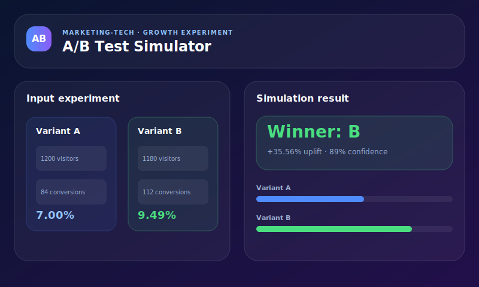

# A/B Test Simulator

> Tool Marketing-Tech vanilla JS pentru simularea rapidă a unui A/B test înainte de lansarea live.

[Live Demo](https://laurandreea10.github.io/codepen-portfolio/ab-test-simulator.html)



---

## Project Origin

A/B Test Simulator continuă roadmap-ul Marketing-Tech din portofoliu: după CampaignPilot și ROI Calculator, următorul pas logic este un tool care ajută echipele să decidă rapid dacă o variantă de headline, CTA sau landing copy merită rulată live.

Tool-ul folosește input-uri simple — trafic, conversii și valoare medie conversie — și produce o interpretare orientată spre decizie: winner, uplift, confidence și impact estimat în revenue.

---

## Features

- Variant A vs Variant B
- Obiectiv test: headline, CTA, landing copy, email subject
- Conversion rate calculat automat
- Uplift estimat
- Winner confidence
- Impact estimat în revenue
- Recomandări de next step
- Copy report to clipboard
- Demo scenario precompletat
- RO/EN persistent
- Dark/Light mode
- High contrast mode
- localStorage pentru ultimul experiment
- Zero backend, zero build

---

## Stack

- HTML
- CSS variables
- Vanilla JavaScript
- localStorage
- GitHub Pages

---

## Formula logic

```js
rateA = conversionsA / visitorsA * 100;
rateB = conversionsB / visitorsB * 100;
uplift = (bestRate - baseRate) / baseRate * 100;
confidence = heuristic(visitorsTotal, rateDelta);
revenueImpact = abs(rateDelta) * avgTraffic * averageConversionValue;
```

Confidence-ul este o estimare euristică pentru decizie de produs, nu un test statistic academic complet. Scopul tool-ului este triere rapidă înainte de un experiment real.

---

## Roadmap

- [ ] Statistical significance calculator complet
- [ ] Sample size estimator
- [ ] Multi-variant test A/B/C
- [ ] Export CSV
- [ ] Template-uri pe industrii

---

## Author

**Laura Andreea** · [Portofoliu](https://laurandreea10.github.io/codepen-portfolio/) · [GitHub](https://github.com/LaurAndreea10)
