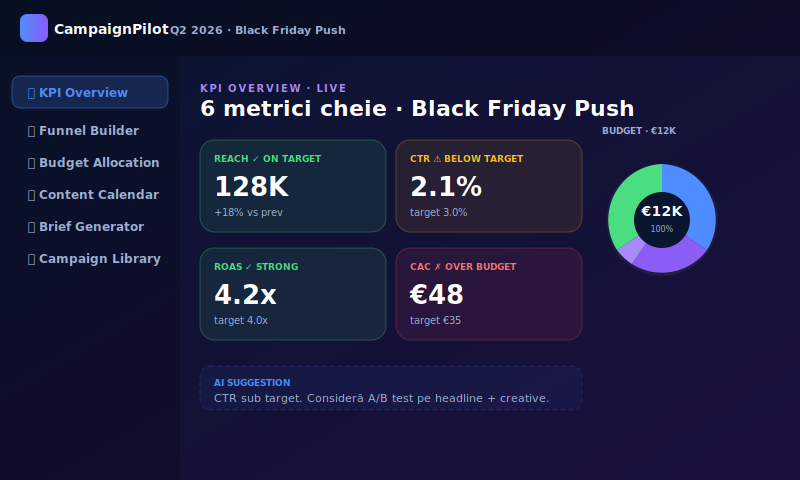
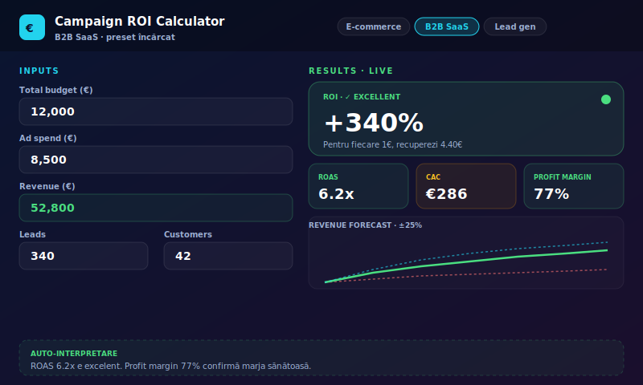
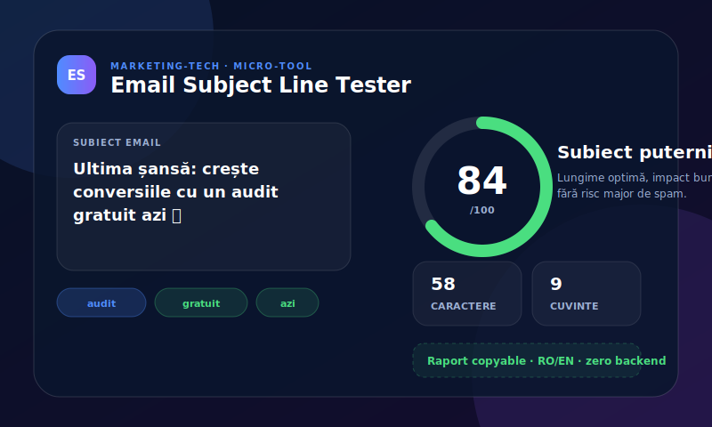

# Marketing-Tech Toolkit

> Tool-uri front-end pentru echipe de marketing și growth — open source, fără backend, bilingv RO/EN.

Această secțiune documentează tool-urile marketing-tech construite în portofoliul `codepen-portfolio`. Fiecare tool este self-contained, deployabil pe GitHub Pages și gândit pentru zero costuri operaționale.

---

## Tools disponibile

### 📊 [CampaignPilot](./CampaignPilot/README.md)

Workspace unificat pentru planificarea unei campanii — KPI, funnel, budget, calendar și brief generator.

[Live Demo](https://laurandreea10.github.io/codepen-portfolio/campaignpilot.html) · [Docs](./CampaignPilot/README.md) · [Changelog](./CampaignPilot/CHANGELOG.md)

---

### 💰 [Campaign ROI Calculator](./ROI-Calculator/README.md)

Calculator interactiv pentru ROI, ROAS, CAC și profitability — cu interpretare automată și industry presets.

[Live Demo](https://laurandreea10.github.io/codepen-portfolio/Campaign%20ROI%20Calculator.html) · [Docs](./ROI-Calculator/README.md) · [Changelog](./ROI-Calculator/CHANGELOG.md)

---

### 🧪 [A/B Test Simulator](./AB-Test-Simulator/README.md)

Simulator rapid pentru headline, CTA, landing copy și email subject — uplift, winner confidence, revenue impact și recomandări next-step.

[Live Demo](https://laurandreea10.github.io/codepen-portfolio/ab-test-simulator.html) · [Docs](./AB-Test-Simulator/README.md) · [Changelog](./AB-Test-Simulator/CHANGELOG.md)

---

### ✉️ [Email Subject Line Tester](./Email-Subject-Line-Tester/README.md)

Micro-tool pentru testarea subiectelor de email: lungime, cuvinte de impact, emoji, clarity score și risc de spam.

[Live Demo](https://laurandreea10.github.io/codepen-portfolio/email-subject-line-tester.html) · [Docs](./Email-Subject-Line-Tester/README.md) · [Changelog](./Email-Subject-Line-Tester/CHANGELOG.md)

---

### 📧 Lead Magnet Landing

Template modular pentru lead magnet pages — hero hook, social proof, preview cu tabs, email gate, thank-you flow.

[Live Demo](https://laurandreea10.github.io/codepen-portfolio/lead-magnet-landing.html)

---

## Principii comune

| Principiu | Implementare |
|---|---|
| Zero backend | Totul este client-side; persistență cu localStorage |
| Bilingv RO/EN | Toggle persistent și string-uri externalizate |
| Theme aware | Dark/Light + high-contrast support |
| Mobile-first | Funcționează pe ecrane mici, 320px+ |
| Vanilla JS | Zero framework în production |
| Accessible | ARIA labels, keyboard navigation, prefers-reduced-motion |
| GitHub Pages deployable | Fișiere statice, zero build pipeline necesar |

---

## Roadmap unificat

- [x] A/B Test Simulator — copy variants + estimare uplift
- [x] Email Subject Line Tester — analiză cuvinte, lungime, emoji impact
- [ ] UTM Builder — construiește link-uri tracked cu validare
- [ ] Conversion Funnel Visualizer — funnel customizabil cu drop-off rates
- [ ] Industry Benchmarks Dashboard — date live din publicații marketing

---

## Author

**Laura Andreea** — Front-end developer cu background în CRM & Marketing.

- [Portofoliu](https://laurandreea10.github.io/codepen-portfolio/)
- [GitHub](https://github.com/LaurAndreea10)
- [LinkedIn](https://www.linkedin.com/in/laura-andreea-p-8b230014b/)
